# Product discovery

Pré-requisitos: <a href="01-Contexto.md"> Documentação de contexto</a>

✅ [Documentação de Design Thinking (MIRO)](files/processo-dt.pdf)

---

## Etapa de entendimento

### Matriz CSD

  

### Mapa de Stakeholders

  

---

## Etapa de definição

### Personas

<table style="border-collapse: separate; border-spacing: 20px;">
  <tr>
    <td align="center">
      <strong>Persona 1</strong> 
      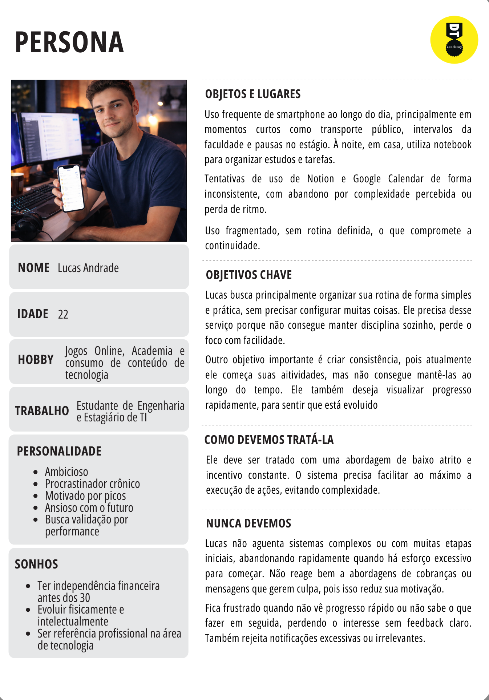  
      <strong>Mapa de Empatia</strong> 
      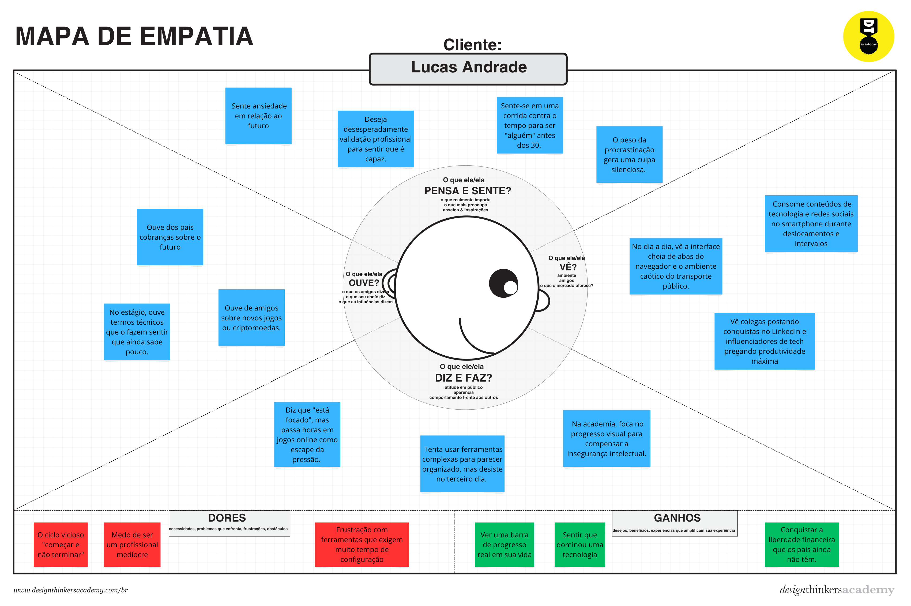
    </td>

    <td align="center">
      <strong>Persona 2</strong> 
        
      <strong>Mapa de Empatia</strong> 
      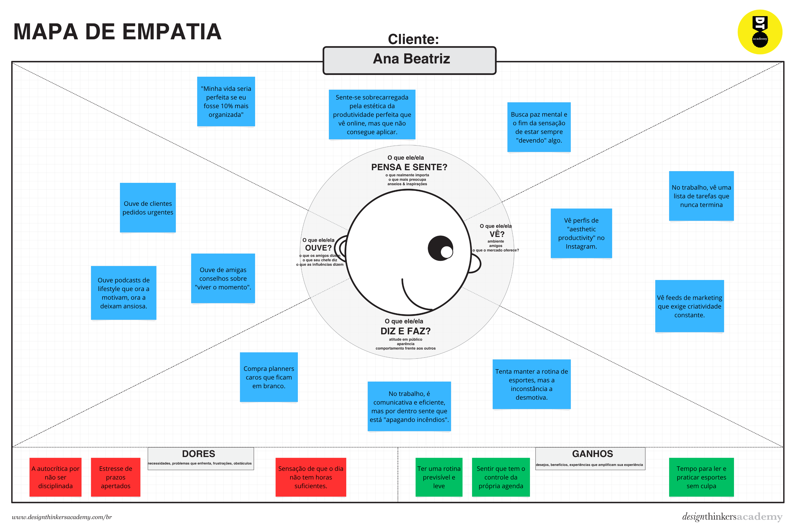
    </td>
  </tr>

  <tr>
    <td align="center">
      <strong>Persona 3</strong> 
      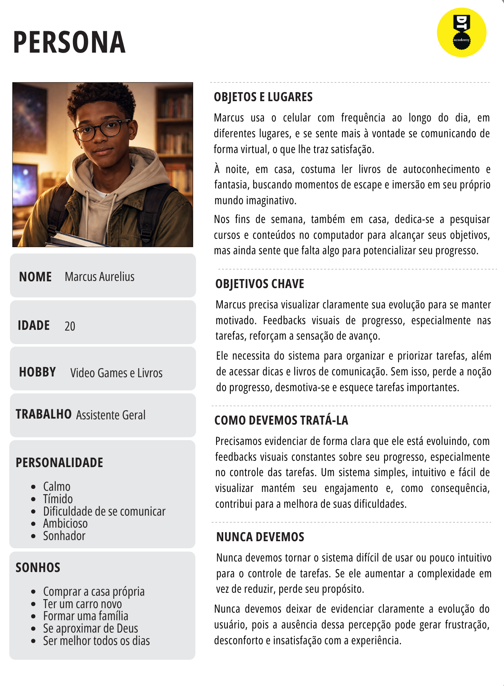  
      <strong>Mapa de Empatia</strong> 
      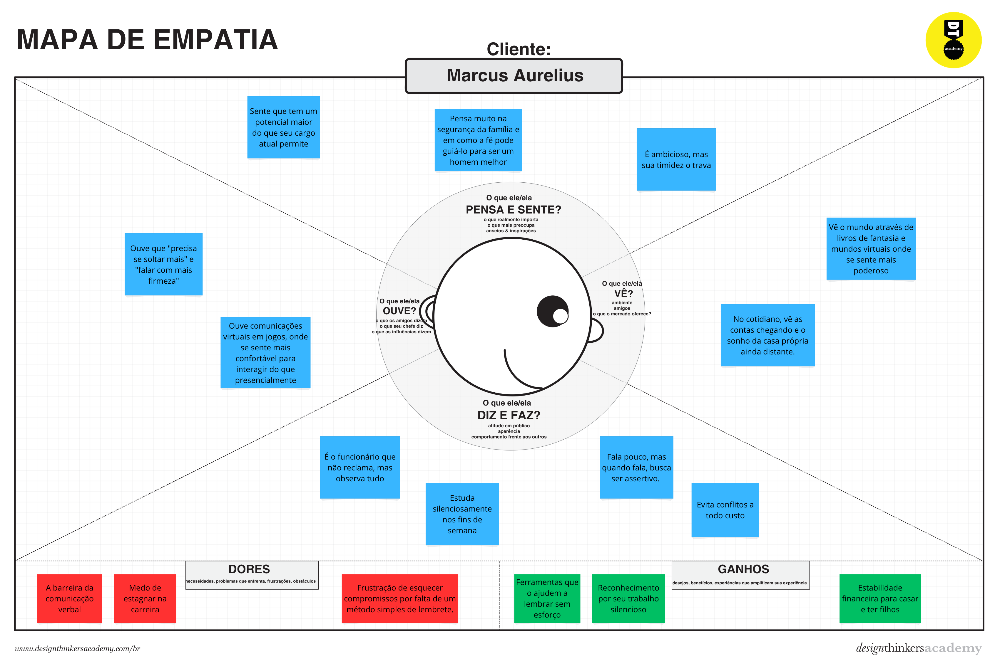
    </td>

    <td align="center">
      <strong>Persona 4</strong> 
      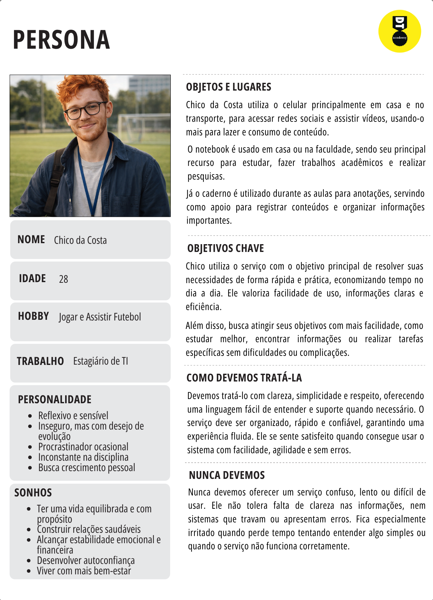  
      <strong>Mapa de Empatia</strong> 
      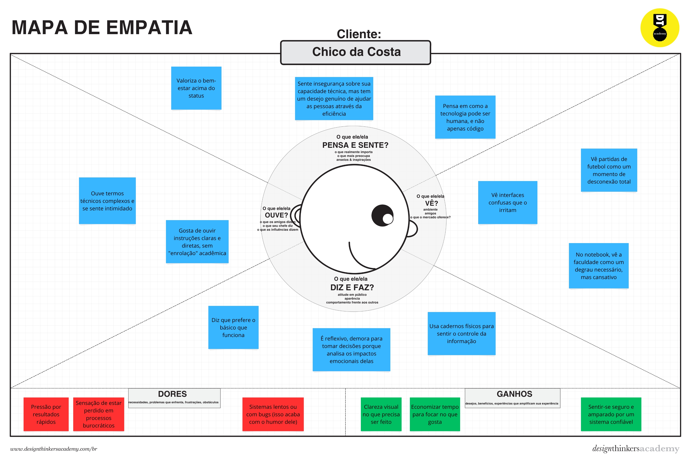
    </td>
  </tr>

  <tr>
    <td align="center">
      <strong>Persona 5</strong> 
      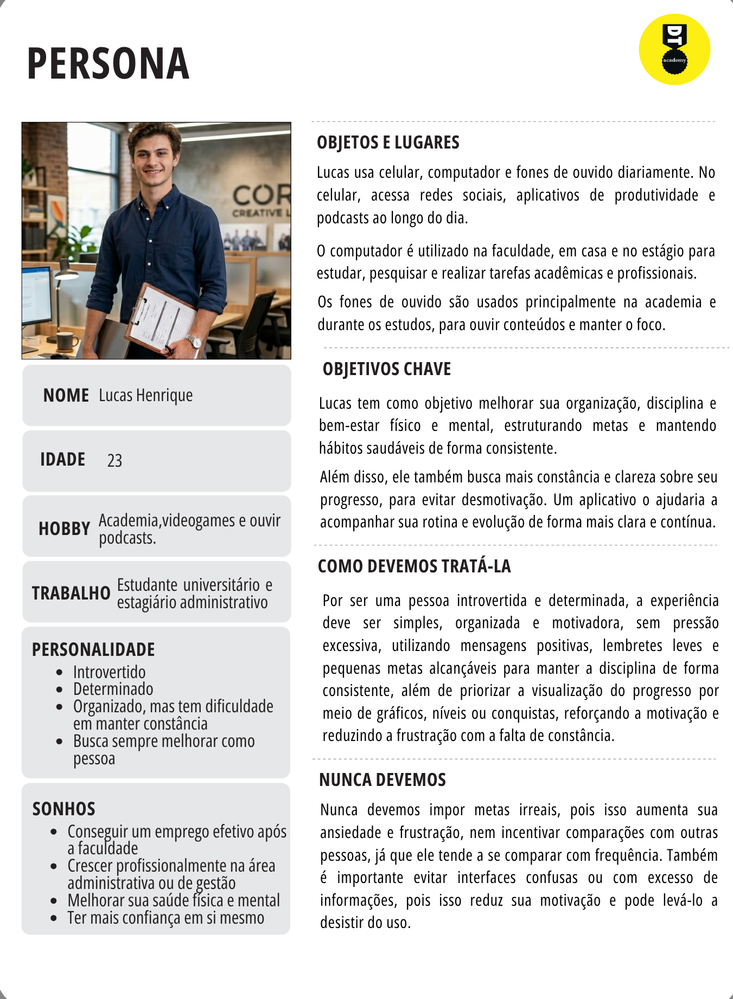  
      <strong>Mapa de Empatia</strong> 
      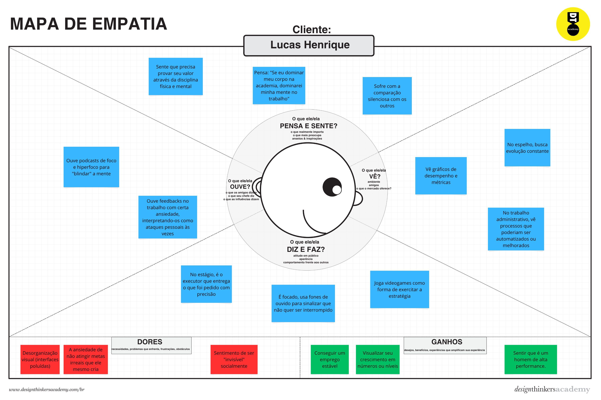
    </td>

    <td align="center">
      <strong>Persona 6</strong> 
      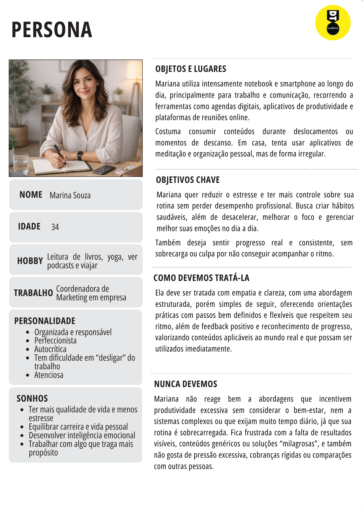  
      <strong>Mapa de Empatia</strong> 
      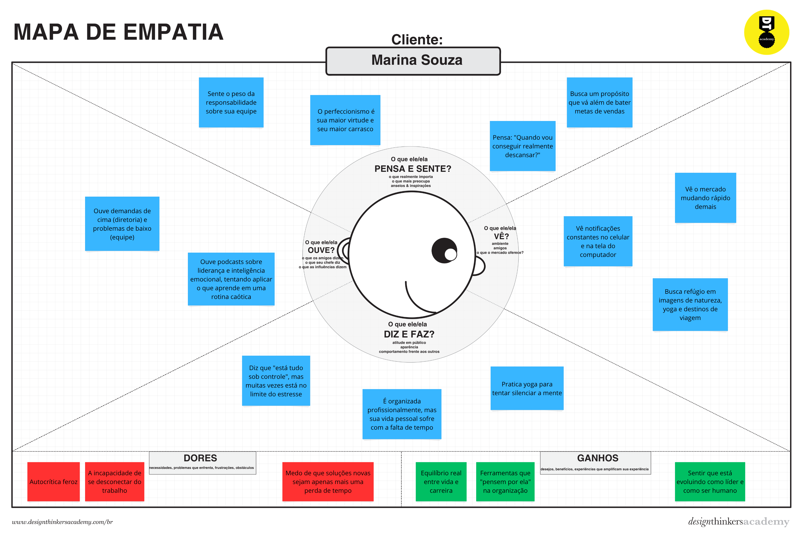
    </td>
  </tr>
</table>

